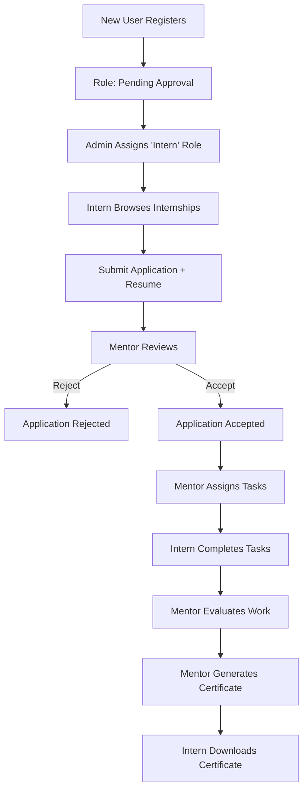
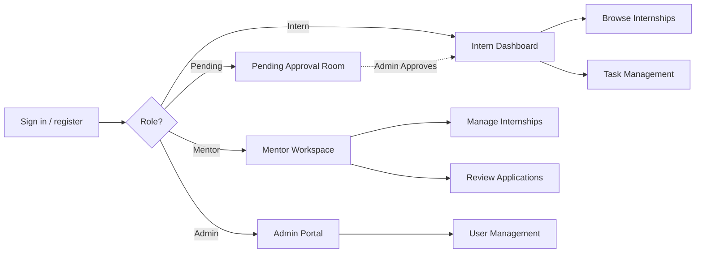

# Internship Management Portal

> **Internship Management Portal**
> A comprehensive, full-stack application to streamline the internship lifecycle.

The **Internship Management Portal** is a specialized platform built for HR teams, engineering mentors, and interns. It manages the complete lifecycle of corporate internships — from posting open roles and handling candidate applications, to assigning day-to-day tasks, tracking progress, and issuing final completion certificates.

This repository is **a working full-stack MVP** (MERN). The sections below outline the design deliverables (user roles, key features, workflow diagram, wireframes, MVP definition) and the rest of the README explains how to run it.

- **Backend:** Node + Express in an MVC layout, MongoDB via Mongoose, JWT auth, bcrypt password hashing, Cloudinary integration for resume and avatar uploads.
- **Frontend:** Vite + React + Tailwind CSS, React Router, Axios, and `react-hot-toast` for UI notifications.

---

## The product thinking behind it
**Problem.** Corporate internship programs often suffer from disjointed workflows: HR uses spreadsheets to track candidates, mentors use Slack/email to assign tasks, and interns lose track of their progress and feedback. It's difficult to monitor intern performance, and issuing certificates is a manual, tedious process.

**Insight.** The entire process (Application → Onboarding → Mentorship → Certification) belongs in one unified platform. By introducing role-based access control (Admin, Mentor, Intern) and a pending waitlist, the platform ensures secure, structured, and transparent internship management.

**Why it wins.**
- **Interns** get a clear view of open roles, their application statuses, assigned tasks, and a centralized profile.
- **Mentors** get a dedicated dashboard to review applications, assign tasks, evaluate submissions, and generate certificates.
- **Admins** get a bird's-eye view of all users, the ability to securely approve new registrations, and manage the platform's data.

---

## 1. User roles
| Role | Who they are | What they can do |
| --- | --- | --- |
| **Pending** | Newly registered user (Default) | Wait in the "Pending Approval" room. Cannot access the portal until an Admin reviews and assigns them a proper role. |
| **Intern** | The candidate / student | Browse open internships, submit applications, upload a profile avatar and resume via Cloudinary, view assigned tasks, and download completion certificates. |
| **Mentor** | Senior engineer / team lead | Post new internships, review intern applications (accept/reject), view candidate resumes natively, assign tasks, evaluate task submissions, and issue certificates. |
| **Admin** | Program manager / HR | Everything a mentor can do, plus: manage all people (approve pending users, assign roles), and oversee all platform internships. |

**Permission model (enforced server-side):**

| Capability | Pending | Intern | Mentor | Admin |
| --- | :---: | :---: | :---: | :---: |
| Register / wait for approval | ✅ | ✅ | ✅ | ✅ |
| Manage own profile (Avatar/Resume) | — | ✅ | ✅ | ✅ |
| Browse & apply to internships | — | ✅ | — | — |
| View own tasks & certificates | — | ✅ | — | — |
| Create & manage internships | — | — | ✅ | ✅ |
| Review applications & issue certificates | — | — | ✅ | ✅ |
| Assign & evaluate tasks | — | — | ✅ | ✅ |
| Approve pending users & manage roles | — | — | — | ✅ |

---

## 2. Key features
**Internship & Application Engine**

- **Role Approval Workflow** — New registrations default to `pending`. Admins must manually verify and assign the user to an `intern` or `mentor` role to unlock dashboard access.
- **Dynamic Resumes** — Resumes are uploaded to Cloudinary. Mentors can view candidate resumes natively in their browser directly from the application review dashboard without forced downloads.
- **Application Funnel** — Interns apply with a cover letter. Mentors review the queue, accept or reject candidates, and the system automatically tracks filled seats vs total capacity.

**Mentorship & Task Management**

- **Task Assignments** — Mentors can create specific tasks for their accepted interns.
- **Task Evaluation** — Interns mark tasks as complete; mentors review the work and can mark it as approved or request changes.
- **Certificate Generation** — Upon successful completion of the internship, mentors can instantly generate and issue a Certificate of Completion to the intern.

**Platform & Security**

- JWT authentication with secure HTTP-only cookies (or Bearer tokens), self-service profile editing, and robust route guarding.
- Elegant UI powered by Tailwind CSS and `react-hot-toast` for seamless notifications.

---

**Intern Lifecycle (The Core Loop):**



**Role-based entry flow:**



---

## Wireframes
Low-fidelity layouts of the primary screens (these map 1:1 to the built pages).

**Intern Dashboard**
```text
+--------------------------------------------------------------+
|  Internship Portal      Dashboard  Browse  My Tasks  ⎋       |
+--------------------------------------------------------------+
|  ( 🙂 )  Hi, Intern 👋                        [ Profile ⚙ ]  |
|          Applied to 3 Internships · 2 Tasks Pending          |
+----------------------------------+---------------------------+
|  MY INTERNSHIPS                  |  OPEN INTERNSHIPS         |
|  Full Stack Engineer             |  Cloud Engineer           |
|  [ Xebia ] [ Accepted ]          |  [ Amazon ] [ Apply ]     |
+----------------------------------+---------------------------+
```

**Mentor — Review Queue**
```text
+--------------------------------------------------------------+
|  Mentor Workspace        ( Internships | Applications )      |
+--------------------------------------------------------------+
|  ( 🙂 ) Candidate applied for "Full Stack Engineer"          |
|  Link: [ View Candidate Resume ]                             |
|  Cover Letter: I am highly interested in this role.          |
|                  [ Reject ] [ Accept ]                       |
+--------------------------------------------------------------+
```

---

## MVP definition
The MVP is the smallest product that proves the core hypothesis: *a unified, role-based platform can drastically improve the efficiency of corporate internship programs.* Everything required for that loop is **built in this repo**.

**In scope (built):**
- Email/password auth with role-based routing (Admin, Mentor, Intern, Pending).
- Internship catalog with creation, updating, and applying.
- Full application lifecycle: submit → mentor review → accept/reject.
- Task management engine: assign tasks, evaluate work.
- Dynamic PDF Certificate generation for completed internships.
- Admin dashboard for user role assignments and platform oversight.
- Cloudinary integration for resume and profile picture uploads.

**Explicitly out of scope (future):**
- Real-time chat between mentors and interns.
- Complex analytics graphs (bar charts/pie charts).
- Auto-graded technical assessments.
- Email or SMS notifications.

**Success metrics to validate the MVP:**
- **Activation:** % of pending users successfully assigned a role within 24h.
- **Engagement:** Daily active interns submitting tasks.
- **Quality/throughput:** Application-to-decision time by mentors.

---

## Mapping to the evaluation parameters
- **Product thinking** — Clear problem → insight → solution; a tightly scoped MVP with explicit out-of-scope cuts and measurable success metrics.
- **Creativity** — Using dynamic PDF generation for completion certificates and seamless browser-native resume viewing via Cloudinary.
- **Communication** — This README: roles, features, diagrams, wireframes, and MVP laid out for a reader to grasp quickly.
- **Collaboration** — The mentor↔intern loop is the product's heart; task assignment and evaluation are first-class features.
- **Leadership** — Admin role management gives a program owner the levers to securely run, grow, and unblock the platform.

---

## 3. Project structure
```text
.
├── backend/                # Express API (MVC)
│   ├── server.js           # entry point
│   └── src/
│       ├── app.js          # express app + middleware wiring
│       ├── config/         # db connection setup
│       ├── models/         # Mongoose schemas (User, Internship, Application, Task, Certificate)
│       ├── controllers/    # auth, users, internships, applications, uploads
│       ├── routes/         # route definitions
│       ├── middlewares/    # auth (protect/authorize), error handling, multer upload
│       └── services/       # business logic layers for cleanly separated concerns
└── frontend/               # Vite React app
    └── src/
        ├── api/            # axios client configuration
        ├── context/        # auth context providers
        ├── components/     # shared UI primitives, cards, buttons, layouts
        └── pages/          # Login, Register, Pending Approval, Mentor/Admin/Intern Dashboards
```

## 4. Prerequisites
- Node.js 18+
- MongoDB running locally (`mongodb://127.0.0.1:27017`) **or** a MongoDB Atlas connection string.
- Cloudinary Account (for avatar and resume uploads).

### Backend Setup
```bash
cd backend
npm install
# Create a .env file based on environment variables below
npm run seed                  # creates an admin, mentors, internships, and tasks
npm run dev                   # starts on http://localhost:5000
```

Default seeded accounts:

| Role | Email | Password |
| --- | --- | --- |
| Admin | `admin@xebia.com` | `admin123` |
| Mentor | `mentor1@xebia.com` | `mentor123` |
| Intern | `intern1@gmail.com` | `intern123` |

Register your own **new** account from the sign-up page to experience the `pending` waitlist flow!

#### Environment variables (`backend/.env`)

| Variable | Description |
| --- | --- |
| `PORT` | Backend port (default `5000`) |
| `CLIENT_URL` | Frontend origin allowed by CORS (default `http://localhost:5173`) |
| `MONGODB_URI` | MongoDB connection string |
| `JWT_SECRET` | Secret used to sign JWTs |
| `CLOUDINARY_CLOUD_NAME` | Cloudinary cloud identifier |
| `CLOUDINARY_API_KEY` | Cloudinary API Key |
| `CLOUDINARY_API_SECRET` | Cloudinary API Secret |

### Frontend Setup
```bash
cd frontend
npm install
npm run dev                   # starts on http://localhost:5173
```

The Vite dev server runs entirely independent, utilizing the configured `axios` instance to hit `http://localhost:5000/api`.
